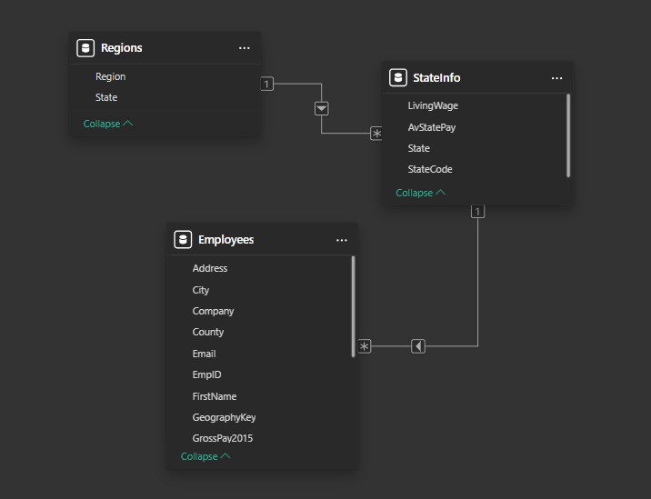
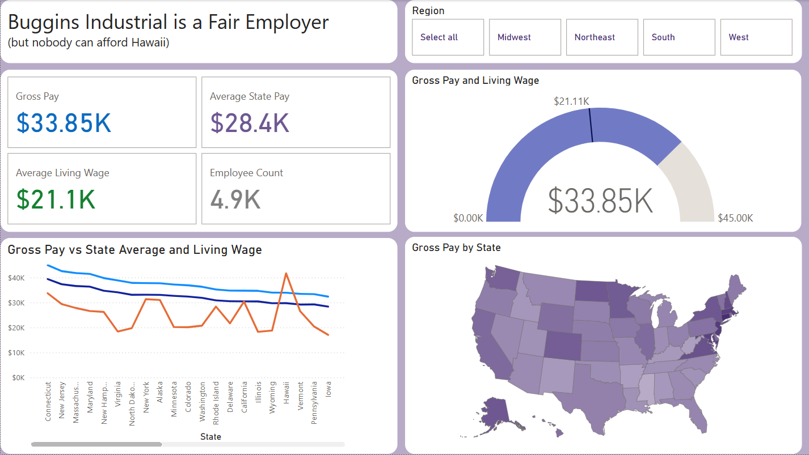

## State Pay Fairness BI Dashboard  
**Tools:** Power BI, Excel, CSV, DAX  

### Objective  
Evaluate whether employees at a fictional company are paid fairly across U.S. states by comparing their wages to state averages and regional living wage benchmarks.

---

### Data & Modelling  
- Built a **hierarchical data model** using three datasets:
  - `employees.csv` – Employee-level pay data  
  - `stateinfo.xlsx` – State-level average pay and living wage data  
  - `regions.xlsx` – U.S. region classifications  
- Data model:  
  `Regions → StateInfo → Employees`  
  This model enables hierarchical filtering by region and state.

---

### Dashboard Features (Single Page in Power BI)  
- **Cards**:
  - Total gross pay  
  - Average state pay  
  - Living wage (average across states)  
  - Employee count  
- **Gauge Visual**:
  - Comparison of company-wide average pay vs national living wage
- **Line Chart**:
  - State-by-state comparison: employee gross pay vs state average pay vs living wage  
- **Map Visual**:
  - Geographic distribution of employee gross pay by state
- **DAX**:
  - Gross Pay = AVERAGE(Employees[GrossPay2015])
  - Living Wage = AVERAGE(StateInfo[ LivingWage ])
  - State AV = AVERAGE(StateInfo[AvStatePay])

  
---

### Key Insights  
- Employees are paid **above the state average in all locations**, indicating overall fair compensation.  
- **Hawaii** stands out as an exception — the cost of living (measured by the living wage) exceeds both the state average pay and employee pay, suggesting it may be **unaffordable** for workers.

---

### Summary  
A compact Power BI project that combines data modelling, regional segmentation, and insight-driven storytelling to explore real-world HR and compensation questions. Useful for stakeholders in finance, HR, and executive decision-making.
